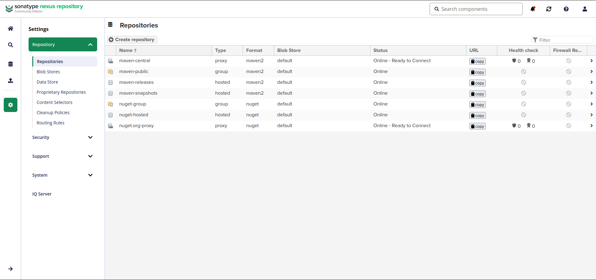

<div align="center">

# ⚓ KubeQuest


**Automatisation et déploiement d'infrastructure cloud sur AWS**

</div>

---
## 📖 À propos

Nexus Repository Manager est utilisé dans le projet KubeQuest comme **registry privé** pour :

- Stocker les **images Docker** de nos applications

---
## 🚀 Déploiement

### Lancement

```bash
 docker compose -f docker-compose-nexus.yml up -d
```

Vérifier que le conteneur est bien démarré :

```bash
 docker compose -f docker-compose-nexus.yml ps
```
---

## 🔑 Accès à l'interface

### 1. Récupérer le mot de passe admin

```bash
 docker exec nexus cat /nexus-data/admin.password
```

### 2. Première connexion

- Accéder à l'interface : `http://51.178.52.51:8018`
- Login : `admin`
- Mot de passe : celui récupéré à l'étape précédente
- Nexus impose un **changement de mot de passe** à la première connexion
- Nouveau mot de passe sur Infiscale

---

## 🗂️ Création des repositories

### Docker Hosted (port 8019)

Repository pour stocker nos images Docker.

> **Settings** → **Repositories** → **Create repository** → **docker (hosted)**

| Paramètre | Valeur |
|-----------|--------|
| Name      | `docker-hosted` | 
| HTTP Port | `8082` |
| Enable Docker V1 API | ❌ |
| Blob store | `default` |
| Deployment policy | `Allow redeploy` |



---

## 🐳 Utilisation avec Docker

### Se connecter au registry

```bash
 docker login 51.178.52.51:8019
```

### Taguer et pousser une image

```bash
 docker tag mon-app:latest 51.178.52.51:8019/mon-app:1.0.0
 docker push 51.178.52.51:8019/mon-app:1.0.0
```

### Puller une image

```bash
docker pull 51.178.52.51:8019/mon-app:1.0.0
```

---

<div align="center">

**Projet KubeQuest**

</div>